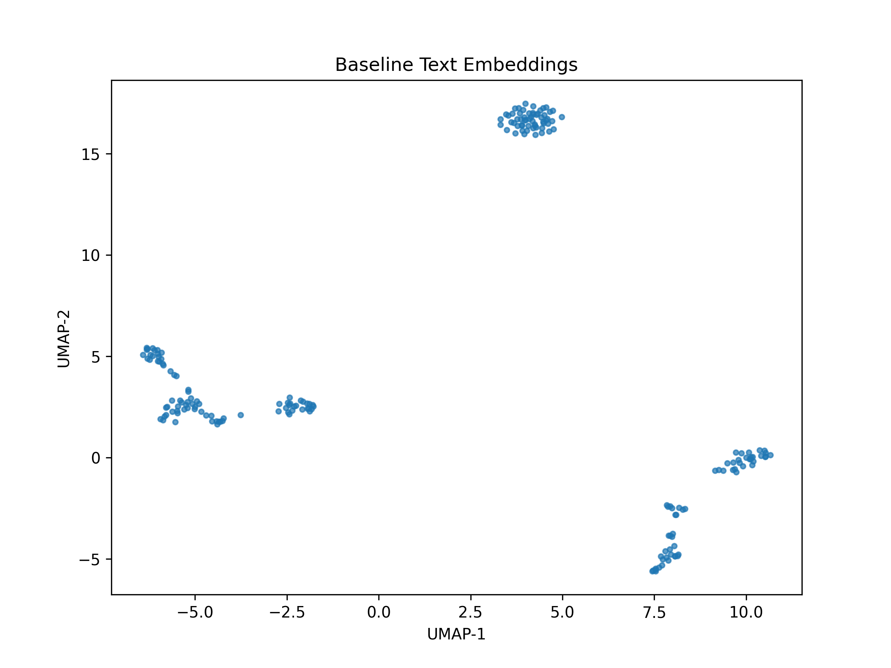
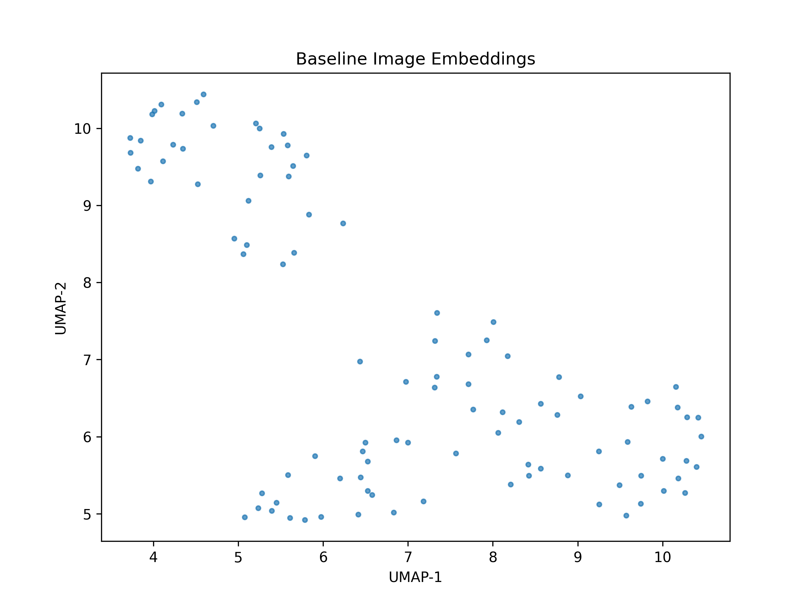

# 📝 Latent Concept Drift Detection for LLMs & Vision Models

**Detect semantic and distributional drift in both text (LLMs) and images (CLIP) using embedding alignment, Wasserstein distance, and BERTScore.**  
Use it to detect when LLMs' or vision models' "understanding" shifts over time.

---
# 📌 Why This Matters

- **LLMs go stale** – A model trained in 2020 won't recognize 2024 slang, trends, or new concepts.
- **Image models experience visual drift** – Camera quality, lighting conditions, and domain changes affect embeddings.
- **Companies need monitoring systems** – Instead of retraining every week, we track **when drift happens** and retrain **only when necessary**.

---
# 🏗️ How It Works

✅ **Text Embedding Drift** – Tracks semantic shifts in your laguage model's embeddings over time.  
✅ **Image Embedding Drift** – Detects when vision models start seeing the world differently.  
✅ **Metrics Used:**
   - **BERTScore** – Semantic similarity loss (text-only)
   - **Wasserstein Distance** – How much embedding distributions shift
   - **Alignment Loss** – Geometric shift in embedding space

---
# 📊 Results

## 1️⃣ Simulated Drift (Artificial Noise)

| Metric                   | Text Drift (Simulated) | Image Drift (Simulated) |
|-----------------|----------------|----------------|
| **BERTScore F1** (Semantic Similarity) | `0.7854` | N/A |
| **Wasserstein Distance** (Distributional Shift) | `0.3297` | `0.0672` |
| **Alignment Loss** (Embedding Movement) | `624.55` | `52.47` |

### **🔍 Simulated Drift Visualizations**
**Baseline Text Embeddings**  
  

**Drifted Text Embeddings** (after noise injection)  
  

**Baseline Image Embeddings**  
  

**Drifted Image Embeddings** (after simulated jitter)  
  

---
## 2️⃣ Real-World Drift (Text & Image)

We compared embeddings from **two different time periods/domains:**
- **Baseline Text:** Wikipedia-style data (wikitext-2)
- **Drift Text:** News articles (AG News)
- **Baseline Images:** Standard CIFAR10 images
- **Drift Images:** CIFAR10 with color distortions (mimicking real-world visual changes)

### **📊 Real-World Drift Logs**

| Metric                   | Text Drift (Real) | Image Drift (Real) |
|-----------------|----------------|----------------|
| **BERTScore F1** (Semantic Similarity) | `0.5608` ⬇ (huge shift) | N/A |
| **Wasserstein Distance** (Distributional Shift) | `0.6268` ⬆ (biggest shift) | `0.0784` |
| **Alignment Loss** (Embedding Movement) | `1114.00` ⬆ (LLM structure changed) | `80.43` |

### **🔍 Real-World Drift Visualizations**
**Baseline Text Embeddings (Wiki-style)**  
  

**Drifted Text Embeddings (News-style)**  
  

**Baseline Image Embeddings**  
  

**Drifted Image Embeddings (Color shift applied)**  
  

---
# ⚙️ Installation & Usage

## 1️⃣ Install Dependencies
```bash
pip install -r requirements.txt
python src/main.py
```

# 🚀 Key Takeaways

- Text drift (semantic shift) is significant between domains (Wikipedia → News).
- Image drift (visual distribution shift) is weaker unless major changes (e.g., resolution, dataset shift) occur.
- BERTScore is crucial for text monitoring but doesn’t apply to images.
- Embedding-based methods allow model monitoring without full inference.
